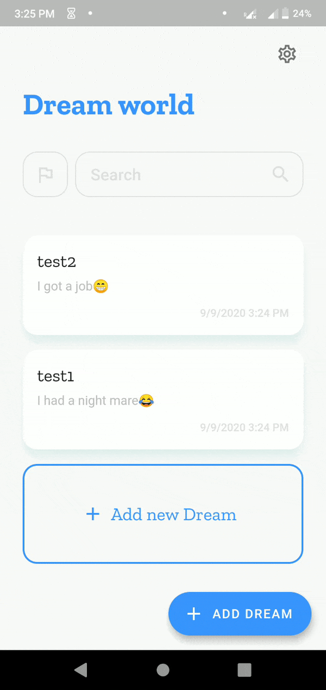

# dream_world

A Flutter App to store your dreams.

## Features: 

1. An interactive & minimalist user interface with animations.

2. Theme Switching: Light and dark theme variants.

3. filtering favorite dreams: Implemented a feature to flag favorite dreams and filter them.

4. Search: Search your dream from database.

5. Edit and Delete previously saved dreams

6. Share dreams with external apps to your friends.

## TechStack :

- Flutter
- Dart
## Dependencies :

- outline_material_icons: ^0.1.0
- sqflite: ^1.1.5                 
- intl: ^0.15.8
- url_launcher: ^5.0.3
- shared_preferences: ^0.5.3+1
- share: ^0.6.1+1

## Working Demo :

